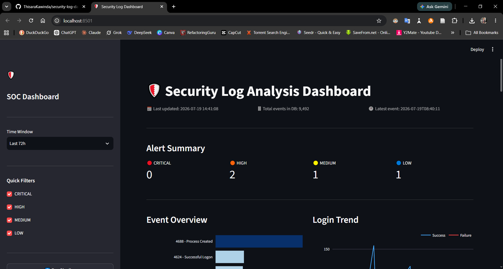
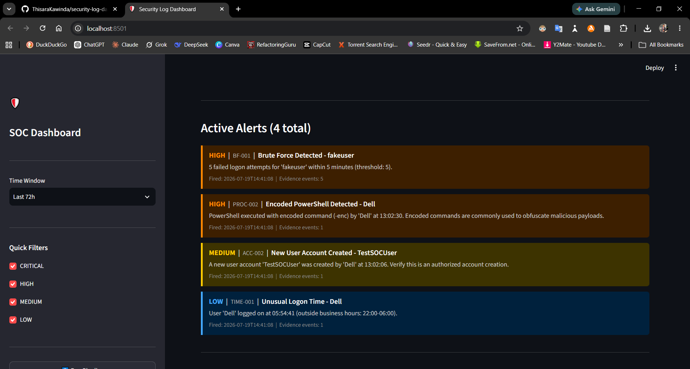
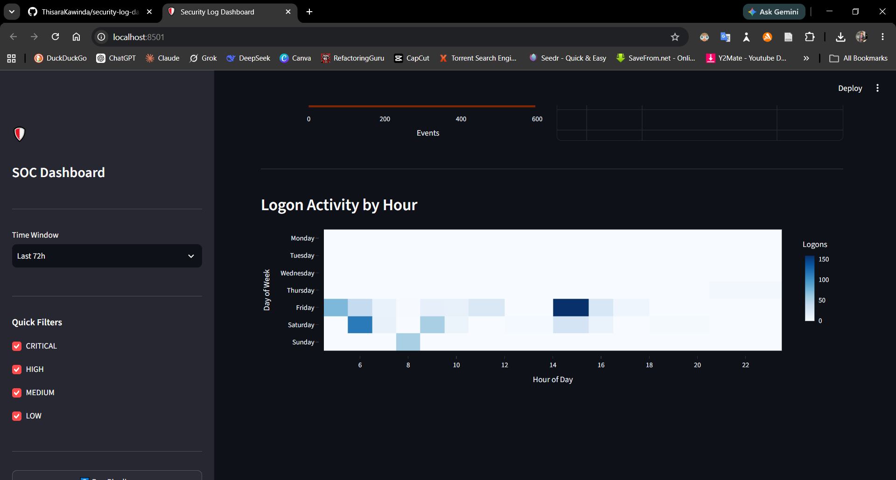

# Security Log Analysis Dashboard

A Python-based security monitoring tool that collects, parses, analyzes,
and visualizes Windows Security Event Logs to identify suspicious activities
and provide actionable security insights.

Built as a SOC Analyst portfolio project to demonstrate real detection
engineering, log forensics, and security data visualization skills.

---

## Screenshots

### Dashboard Overview


### Active Alerts Panel


### Logon Activity Heatmap


---

## Project Status

| Phase | Description | Status |
|-------|-------------|--------|
| 0 | Windows Logging Foundations | Complete |
| 1 | Environment and Audit Policy Configuration | Complete |
| 2 | Log Collection and Parsing Engine | Complete |
| 3 | Detection Engine | Complete |
| 4 | SQLite Storage Layer | Complete |
| 5 | Streamlit Dashboard | Complete |
| 6 | Report Generation | Complete |

---

## Architecture

```
Windows Security Event Log
        |
        v
Log Collector     (collector/)
  - win32evtlog EvtQuery API
  - Split queries: Auth vs Process events
        |
        v
Event Parser      (parser/)
  - XML normalization
  - Field extraction and enrichment
  - Event-type-specific enrichment functions
        |
        v
SQLite Storage    (storage/)
  - Indexed single-table schema
  - Duplicate-safe INSERT OR IGNORE
  - WAL mode for concurrent read/write
        |
        v
Detection Engine  (detection/)
  - Threshold, sequence, and pattern-based rules
  - Event and alert deduplication
  - Structured alert output with severity levels
        |
        v
Streamlit Dashboard (dashboard/)
  - Interactive security visualization
  - Real-time metrics and alert panels
  - Searchable event log table
  - Logon activity heatmap
        |
        v
Report Generator  (reports/)
  - Automated Markdown security summaries
  - Executive summary with status classification
  - Authentication analysis and recommendations
```

---

## Detection Rules Implemented

| Rule ID  | Name                        | Type      | Severity |
|----------|-----------------------------|-----------|----------|
| BF-001   | Brute Force Detection       | Threshold | HIGH     |
| BF-002   | Success After Brute Force   | Sequence  | CRITICAL |
| BF-003   | Password Spray              | Threshold | HIGH     |
| ACC-001  | New Admin Account Created   | Sequence  | CRITICAL |
| ACC-002  | New User Account Created    | Event     | MEDIUM   |
| ACC-003  | Account Lockout             | Event     | MEDIUM   |
| PROC-001 | Known Attack Tool Detected  | Pattern   | CRITICAL |
| PROC-002 | Suspicious Command Line     | Pattern   | HIGH     |
| TIME-001 | Unusual Logon Hours         | Threshold | LOW      |

### Detection Logic Types

**Threshold-based:** Fires when a count exceeds a limit within a time
window. Example: BF-001 fires when the same account accumulates 5+
failed logons within 5 minutes.

**Sequence-based:** Fires when Event A is followed by Event B within
a time window. Example: BF-002 fires when a burst of failures is
followed by a successful logon for the same account — the attacker
got in pattern.

**Pattern-based:** Fires when event content matches a known-malicious
signature. Example: PROC-002 fires when a 4688 event contains -enc
in the command line — the encoded PowerShell obfuscation pattern used
by most commodity malware.

---

## Windows Event IDs Monitored

| Event ID | Description                              |
|----------|------------------------------------------|
| 4624     | Successful Logon                         |
| 4625     | Failed Logon                             |
| 4634     | Logoff                                   |
| 4647     | User Initiated Logoff                    |
| 4672     | Special Privileges Assigned to Logon     |
| 4688     | Process Created (with command line)      |
| 4719     | Audit Policy Changed                     |
| 4720     | User Account Created                     |
| 4726     | User Account Deleted                     |
| 4728     | Member Added to Global Security Group    |
| 4732     | Member Added to Local Security Group     |
| 4740     | Account Locked Out                       |
| 4756     | Member Added to Universal Security Group |

---

## Environment Setup

### Prerequisites

- Windows 10 or Windows 11
- Python 3.10 or higher
- Administrator privileges for log collection

### Installation

Clone the repository and set up the virtual environment:

    git clone https://github.com/ThisaraKawinda/security-log-dashboard.git
    cd security-log-dashboard
    python -m venv venv
    venv\Scripts\activate
    pip install -r requirements.txt
    python venv\Scripts\pywin32_postinstall.py -install

### Audit Policy Configuration

Run the following commands as Administrator to enable required
Windows audit policies before collecting logs:

    auditpol /set /subcategory:"Logon" /success:enable /failure:enable
    auditpol /set /subcategory:"Logoff" /success:enable
    auditpol /set /subcategory:"Account Lockout" /success:enable /failure:enable
    auditpol /set /subcategory:"User Account Management" /success:enable /failure:enable
    auditpol /set /subcategory:"Security Group Management" /success:enable /failure:enable
    auditpol /set /subcategory:"Process Creation" /success:enable
    auditpol /set /subcategory:"Audit Policy Change" /success:enable /failure:enable
    auditpol /set /subcategory:"Special Logon" /success:enable

Enable command-line argument logging via Group Policy Editor:

    gpedit.msc
    Computer Configuration
      Administrative Templates
        System
          Audit Process Creation
            Include command line in process creation events: Enabled

Verify command-line logging is active:

    reg query "HKLM\SOFTWARE\Microsoft\Windows\CurrentVersion\Policies\System\Audit" /v ProcessCreationIncludeCmdLine_Enabled

Expected output: ProcessCreationIncludeCmdLine_Enabled = 0x1

### Running the Pipeline

Run as Administrator to collect logs and populate the database:

    python run_pipeline.py

### Launching the Dashboard

    streamlit run dashboard/app.py

### Generating a Security Report

    python reports/report_generator.py

---

## Project Structure

    security-log-dashboard/
    |
    +-- collector/
    |   +-- __init__.py
    |   +-- log_collector.py       Windows Event Log collection via EvtQuery API
    |
    +-- parser/
    |   +-- __init__.py
    |   +-- event_parser.py        XML normalization and field extraction
    |
    +-- detection/
    |   +-- __init__.py
    |   +-- rules.py               Detection rules and alert generation
    |
    +-- storage/
    |   +-- __init__.py
    |   +-- database.py            SQLite storage layer
    |
    +-- dashboard/
    |   +-- app.py                 Streamlit interactive dashboard
    |
    +-- reports/
    |   +-- report_generator.py    Automated Markdown report generation
    |
    +-- data/
    |   +-- sample_logs/
    |       +-- sample_report.md   Sample generated security report
    |
    +-- screenshots/               Dashboard screenshots
    |
    +-- tests/
    |   +-- test_parser.py         Unit tests
    |
    +-- config.py                  Central configuration and thresholds
    +-- run_pipeline.py            End-to-end pipeline runner
    +-- requirements.txt
    +-- README.md

---

## Key Technical Decisions

### Split Query Architecture

Authentication and process creation events are collected via separate
XPath queries against the Windows Event Log API. This prevents
high-volume process telemetry (approximately 1,700 events per hour on
a monitored endpoint) from exhausting the collection budget before
lower-volume but higher-fidelity authentication events are reached.

This mirrors the architecture used in production SIEM ingestion
pipelines where high-volume sources are processed in dedicated lanes.

### Modern Windows Event Log API

The collector uses EvtQuery and EvtRender from the modern Windows
Event Log API (Vista and later) rather than the legacy ReadEventLog
and SafeFormatMessage path. This ensures fully structured XML is
returned for every event type, enabling reliable field extraction
regardless of event source.

### WAL Mode SQLite

Write-Ahead Logging is enabled on the SQLite database, allowing the
dashboard to read concurrently while the collector pipeline is writing.
This eliminates database locking conflicts in continuous collection mode.

### Duplicate Prevention

A UNIQUE constraint on (timestamp, event_id, computer) combined with
INSERT OR IGNORE makes the pipeline safely re-runnable. Executing
run_pipeline.py multiple times will not create duplicate records.

### Denormalized Single Table

All event types are stored in one table rather than split by event
category. This simplifies cross-event-type correlation queries, which
are the dominant query pattern in a security dashboard. For example,
correlating failed logons with subsequent process execution by the
same user requires a single SQL query rather than a JOIN across
multiple tables.

### Event and Alert Deduplication

Detection rules operate on deduplicated event sets keyed on
(timestamp, event_id, target_user, subject_user). Alert deduplication
collapses rules that fire multiple times on the same logical incident
into a single alert, reducing noise and improving triage efficiency.

---

## Sample Security Report

A sample auto-generated security report is available at:
[data/sample_logs/sample_report.md](data/sample_logs/sample_report.md)

---

## Lessons Learned

- Windows audit policy and command-line logging for Event ID 4688 are
  independently configured. Enabling Process Creation auditing without
  also enabling command-line inclusion produces events that show only
  the process name, not the arguments, which eliminates visibility into
  encoded PowerShell and other command-line-based attack techniques.

- Default Windows audit policy is intentionally minimal due to
  performance and storage considerations. SOC engineers must explicitly
  configure telemetry coverage for each required event category.

- High-volume event sources such as Process Creation (4688) generate
  approximately 1,700 events per hour on an active workstation. Without
  architectural separation, these events consume the entire collection
  budget within minutes, leaving authentication and account management
  events unreachable in the log history.

- The gpupdate /force command may report a timeout on standalone
  workstations even when the policy applied successfully. Always verify
  policy application via the registry directly rather than relying on
  gpupdate exit status.

- Single keyword pattern matching for suspicious processes generates
  significant false positives. Effective detection requires either
  high-confidence single indicators (encoded PowerShell -enc flag) or
  combinations of lower-confidence indicators evaluated together.

---

## Audit Policy Reversion

To revert audit policy to Windows defaults after project completion:

    auditpol /set /subcategory:"Logon" /success:enable /failure:disable
    auditpol /set /subcategory:"Account Lockout" /success:enable /failure:disable
    auditpol /set /subcategory:"User Account Management" /success:enable /failure:disable
    auditpol /set /subcategory:"Security Group Management" /success:disable /failure:disable
    auditpol /set /subcategory:"Process Creation" /success:disable
    auditpol /set /subcategory:"Audit Policy Change" /success:enable /failure:disable
    auditpol /set /subcategory:"Special Logon" /success:disable

---

## Author

Thisara Kawinda
B.Computing (Honours) in Information Systems
University of Sri Jayewardenepura, Colombo, Sri Lanka
github.com/ThisaraKawinda

---

## License

MIT License
